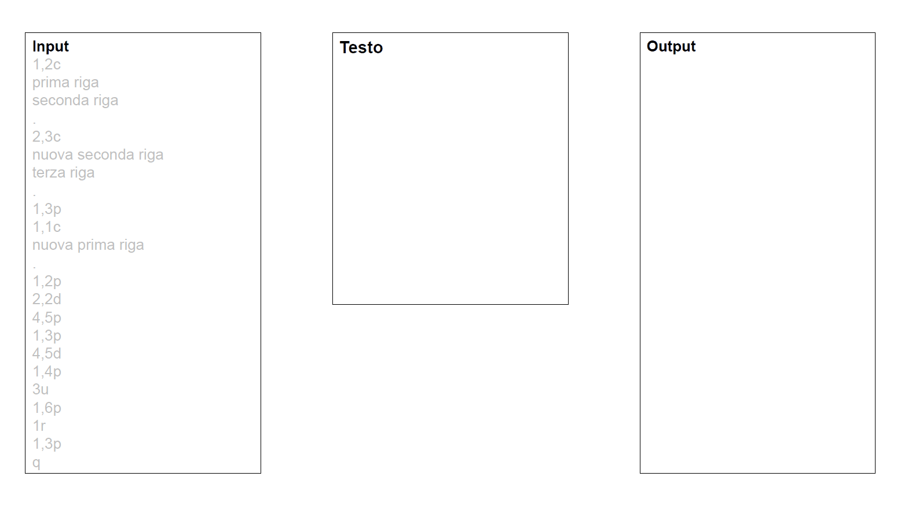

# C ~ API Project
Politecnico di Milano - Accademic Year 2019-2020  
Algorithms and Principles of Computer Science

## Goal
Simulate a Line Text Editor (like Ed) focusing on performances in terms of time and space complexity .
The editor must be able to accomplish a sequence of multiple commands like change, delete, print, undo, redo.

The project aims to choose and implement the correct data structures and algorithms, without utilizing external libraries.

I choose to implement a Stack for the actions and a dynamic Array for the main text.

## Tools
- GDB
- Valgrind
  - massif
  - memcheck
  - callgrind

##
> To see the complete instructions -> [Project presentation](Specifica_progetto_prova_finale_2020.pdf) (:it:)

(Grade: 29/30)
